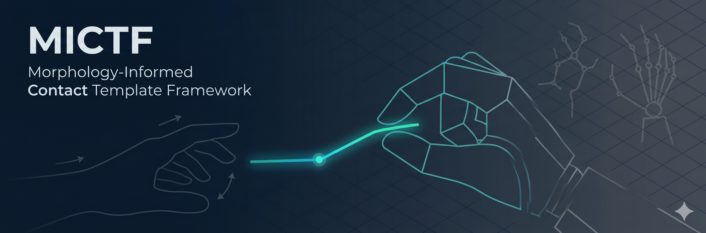

<p align="center">
  
</p>

<h1 align="center">MICTF</h1>

<p align="center">
  <b>Morphology-Informed Contact Template Framework</b><br>
  面向异构灵巧手的零样本跨具身遥操作接触原语框架
</p>

<p align="center">
  <a href="https://youtu.be/rv6dafFKCII"></a>
  <a href="LICENSE"></a>
  
  
  
</p>

<p align="center">
  <b>语言：</b> <a href="README.md">English</a> | <b>简体中文</b>
</p>

---

## ✨ 核心特性

- **零样本手型导入** — 导入任意 MJCF 灵巧手模型，接触模板由形态与传动结构自动生成，无需针对新手型调参或采集示教数据。
- **显式接触语义** — 以结构化的接触原语（精密捏合、多指捏合、闭合等）替代传统方法中隐含在几何误差里的接触信息，实现操作意图的跨具身迁移。
- **概率意图推断** — 基于 HMM 的贝叶斯后验估计，结合后验滞回与最小驻留约束。噪声敏感性测试显示，所有主线手型的**模板翻转率为 0%**。
- **闭链接触投影** — 联合求解间隙闭合、法向对齐和平滑性残差，相比 DexPilot 类基线方法，在异构手型上将平均接触距离**降低 74–82%**。
- **传动异构双路径执行** — 直驱手型走关节空间闭链求解器；耦合/欠驱动手型走执行器空间间接求解器。

---

## 🔍 研究动机

现有遥操作重定向方法（DexPilot、关节复制、指尖 IK）解决的是**"指尖应该去哪里"**，却没有显式表达**"应当维持何种接触关系"**。这一缺失在跨具身迁移中引发三类典型失效：

| 失效模式 | 根本原因 |
|:---|:---|
| 张开 ↔ 闭合切换时拇指根部大幅摆动 | 仅约束指尖位置，拇指运动链存在零空间冗余 |
| 接触法向瞬时翻转 | 缺少面向接触面的法向对齐约束 |
| 接触建立后运动中悄然断开 | 无接触后闭链维持机制 |

MICTF 通过将遥操作的中间表示从几何轨迹提升为**具有物理语义的接触原语**来系统性地解决上述问题。

---

## 🏗️ 系统架构

```
┌─────────────────────────────────────────────────────────┐
│                       输入层                             │
│  ┌──────────────────┐    ┌───────────────────────────┐  │
│  │ Quest 3 / WebXR  │    │ 灵巧手模型 (MJCF)         │  │
│  │ 手部追踪          │    │                           │  │
│  └────────┬─────────┘    └──────────┬────────────────┘  │
│           │                         │                    │
│           ▼                         ▼                    │
│  ┌─────────────────┐    ┌──────────────────────────┐    │
│  │ 特征提取         │    │ 形态与传动语义解析         │    │
│  │ · 捏合距离       │    │ (算法 1)                  │    │
│  │ · 弯曲角度       │    │ · 手指运动链与角色识别     │    │
│  │ · 接近速度       │    │ · 接触坐标系 (SVD)        │    │
│  │ · 接触位置评分    │    │ · 执行器 / 传动规范       │    │
│  └────────┬─────────┘    └──────────┬────────────────┘  │
└───────────┼──────────────────────────┼──────────────────┘
            │                          │
            │                          ▼
            │               ┌─────────────────────┐
            │               │ 接触模板自动枚举      │
            │               │ (算法 2)              │
            │               │ 张开 / 精密捏合 /     │
            │               │ 多指捏合 / 闭合       │
            │               │ + 标准接触位姿离线求解  │
            │               └──────────┬──────────┘
            │                          │
            ▼                          ▼
┌───────────────────────────────────────────────────────┐
│                   意图推断层                            │
│  ┌─────────────────────────────────────────────────┐  │
│  │ 贝叶斯模板意图滤波器 (HMM, 算法 3)              │  │
│  │ · 基于能量的观测似然                             │  │
│  │ · 正运动学几何邻近度转移代价                      │  │
│  │ · 后验滞回 + 最小驻留约束                        │  │
│  └──────────────────────┬──────────────────────────┘  │
└─────────────────────────┼─────────────────────────────┘
                          │
                          ▼
┌───────────────────────────────────────────────────────┐
│                   分层执行层 (算法 4)                   │
│                                                       │
│  ┌─────────────────┐      ┌────────────────────────┐  │
│  │ 直驱路径         │      │ 间接求解路径            │  │
│  │ (Allegro, Wuji,  │      │ (Amazing Hand 等)      │  │
│  │  LEAP, ORCA,     │      │                        │  │
│  │  Sharpa)         │      │ · 执行器通道扰动探测    │  │
│  │                  │      │ · 有限差分雅可比估计    │  │
│  │ 有界非线性最小    │      │ · 执行器空间阻尼        │  │
│  │ 二乘:            │      │   最小二乘             │  │
│  │ · 间隙闭合       │      │ · 配对间隙求解器       │  │
│  │ · 法向对齐       │      │                        │  │
│  │ · 帧间平滑       │      │                        │  │
│  │ · 表面 UV 联合   │      │                        │  │
│  └────────┬────────┘      └───────────┬────────────┘  │
│           │                           │                │
│           ▼                           ▼                │
│  ┌─────────────────────────────────────────────────┐  │
│  │ 执行状态机                                      │  │
│  │ 接近 → 获取 → 跟踪保持 → 保守回退               │  │
│  └──────────────────────┬──────────────────────────┘  │
└─────────────────────────┼─────────────────────────────┘
                          │
                          ▼
                 关节 / 执行器指令
                → MuJoCo / 真实硬件
```

---

## 📊 实验结果

基于 Quest 3 / WebXR 手部追踪日志在 MuJoCo 中离线回放评估。同一只手内所有方法使用**同一段操作者输入**，差异完全来自重定向算法。

### 方法对比

| 手型 | 方法 | 平均距离 (mm) | p95 距离 (mm) | 30mm 成功率 | 保持丢失率 |
|:---|:---|---:|---:|---:|---:|
| **Wuji Right** | **MICTF** | **14.75** | **36.12** | **0.947** | **0.076** |
| Wuji Right | DexPilot 风格 | 57.56 | 81.34 | 0.059 | 0.827 |
| Wuji Right | 关节复制 | 64.85 | 84.33 | 0.009 | 0.976 |
| Wuji Right | 指尖 IK | 73.98 | 93.90 | 0.015 | 0.993 |
| **Allegro Right** | **MICTF** | **14.65** | **35.44** | **0.937** | **0.000** |
| Allegro Right | DexPilot 风格 | 80.61 | 91.40 | 0.000 | 1.000 |
| Allegro Right | 关节复制 | 88.64 | 142.60 | 0.023 | 0.938 |
| Allegro Right | 指尖 IK | 102.55 | 166.06 | 0.003 | 0.991 |

### 消融实验（关键发现）

| 消融模块 | Wuji Right 影响 | Allegro Right 影响 |
|:---|:---|:---|
| 移除闭链投影 | 距离：14.75 → **76.46 mm** | 距离：14.65 → **100.69 mm** |
| 移除时间滤波 | 保持切换次数：0.619 → 0.762 | 高置信后验比例下降 |
| 固定接触点（无表面 UV） | 求解成功率：0.974 → **0.000** | 求解成功率：0.990 → 0.465 |

---

## 🤖 已支持手型

统一导入流程，无需为每只手编写特定代码：

| 手型 | 自由度 | 手指数 | 模板数 | 执行路径 | 验证级别 |
|:---|---:|---:|---:|:---|:---|
| JackHand | 10 | 3 | 9 | 关节空间 | Quest 3 回放 |
| Allegro Right | 16 | 4 | 12 | 关节空间 | Quest 3 回放 |
| Wuji Right/Left | 20 | 5 | 15 | 关节空间 | Quest 3 回放 |
| LEAP Right | 16 | 4 | 12 | 关节空间 | 导入 + 求解器遍历 |
| ORCA Right v1 | 16 | 5 | 15 | 关节空间 | 导入 + 求解器遍历 |
| Sharpa Wave | 22 | 5 | 15 | 关节空间 | 导入 + 求解器遍历 |
| Amazing Hand | 8 执行器 / 32 关节 | 4 | 12 | 执行器间接求解 | VR 回放 (162.6s) |
| Robotiq 2F-85 | 2 | 2 | — | 仅诊断 | 非对掌拓扑诊断 |

> **ORCA Right v1** 和 **Sharpa Wave** 在开发过程中**未经任何适配**即成功导入——系统对这两款手型实现了真正的零样本接入。

---

## 🎬 演示

**四手型对比**（Wuji · Allegro · ORCA · Sharpa）—— 回放操作者运动下的闭链接触维持，1.5 倍速：

<p align="center">
  
</p>
<p align="center"><em>每个面板：同一条回放的 Quest 3 输入，不同的手型形态。接触建立后，四只手均维持了 pad 级接触。</em></p>

单片段演示：

<p align="center">
  <a href="https://youtu.be/rv6dafFKCII">
    
  </a>
  <br>
  <a href="https://youtu.be/rv6dafFKCII">▶ 在 YouTube 上观看</a>
</p>

---

## ⚠️ 当前局限

- **非抓取规划器** — 不包含力闭合、摩擦锥或物体稳定性保证。
- **仅几何接触约束** — 当前回路不包含触觉反馈或接触力估计。
- **静态接触原语** — 覆盖接触建立与保持；手内操作（搓捻、换指）为后续工作。
- **仿真验证阶段** — 真实硬件实验与用户研究已规划，尚未完成。
- **零训练数据** — 运行时完全依赖形态元数据与几何约束，无需标注数据或示教。

---

## 🗺️ 路线图

- [x] 形态导入 + 自动接触坐标系提取
- [x] 基于手型拓扑的接触模板枚举
- [x] 贝叶斯意图滤波器 + FK 转移代价
- [x] 闭链接触后投影 + 表面 UV 联合优化
- [x] 接触前引导轨迹生成
- [x] 耦合/欠驱动手型的执行器空间间接求解
- [x] Quest 3 回放评估（JackHand、Wuji、Allegro）
- [x] 零适配导入验证（ORCA、Sharpa Wave）
- [x] 同轨迹六手型同步回放实验
- [ ] 真实硬件闭环验证
- [ ] 多输入设备支持（数据手套）
- [ ] 物体在手的任务级评估
- [ ] 用户研究（NASA-TLX、任务完成时间）

---

## 💻 代码

源码与实验流水线位于私有仓库，将随论文一并公开。本页面跟踪项目公开状态。

---

## 📖 引用

```bibtex
@article{mo2026mictf,
  title   = {MICTF: Morphology-Informed Contact Template Framework for
             Cross-Embodiment Dexterous Hand Teleoperation},
  author  = {Mo, Huairan},
  journal = {IEEE Robotics and Automation Letters (in preparation)},
  year    = {2026}
}
```

---

## 📄 许可证

文档与素材：[MIT License](LICENSE)。源码许可证将随代码公开时发布。
